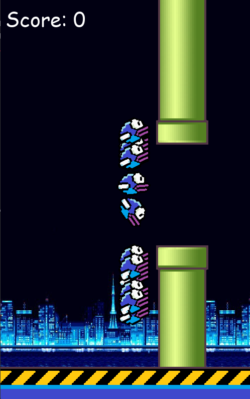

# Flappy Bird NEAT AI 🧠🐦

A self-learning AI that plays Flappy Bird using NEAT (NeuroEvolution of Augmenting Topologies). It learns over generations, improving its gameplay with zero hardcoding. Watch evolution in action!

🔗 [Live Demo (Video/GIF or Hosted Project)](imgs/demo.mp4)


*alt: Screenshot of the Flappy Bird AI in action, dodging pipes*

---

## How It's Made:

**Tech used:** Python, Pygame, NEAT-Python, Matplotlib

This project uses the NEAT algorithm to evolve neural networks that control the bird in a Flappy Bird game. The game is rendered with **Pygame**, and the neural networks are trained using **NEAT-Python**, a library for evolving neural networks. The training loop adjusts each bird’s fitness based on how long it survives and how many pipes it passes. The top-performing genomes are selected to breed the next generation, creating an increasingly intelligent bird over time.

I implemented all game physics, collisions, asset handling, and training logic from scratch. Additionally, I added a replay mode to view the best evolved bird, and graphs to visualize evolution progress and species diversity using **Matplotlib**.

---

## Optimizations:

- **Fitness Tweaks:** Birds are rewarded for staying near the pipe gap center—not just surviving—speeding up convergence.
- **Efficient Collision Checks:** Pipes and avatars are iterated in reverse to safely remove crashed birds mid-loop.
- **Stats Plotting:** Fitness and species growth are plotted post-training to identify stagnation or anomalies.
- **Reusability:** A `test_best()` mode allows reloading the best-trained genome without retraining the whole model.

These optimizations ensure faster evolution, better training data, and a smoother gameplay loop.

---

## 🎮 Play It Yourself!

Want to test your own reflexes? Play Flappy Bird manually with keyboard controls!

### Controls
- Press **↑ arrow** to flap
- Avoid the pipes
- Survive as long as you can to increase your score

### Run It
```bash
python play.py

## Lessons Learned:
This project taught me how powerful evolutionary algorithms can be when paired with visual feedback. Watching birds go from clueless to skillful over generations was exciting and deeply satisfying.

I learned:
- How to integrate machine learning with real-time game environments
- How to evaluate and reward behavior algorithmically
- That visual, interactive ML projects can make abstract concepts like NEAT much more intuitive

Most importantly, I learned how to approach a project from end to end: from building the game, to integrating AI, to designing a user-friendly experience with graphs and replay features.

